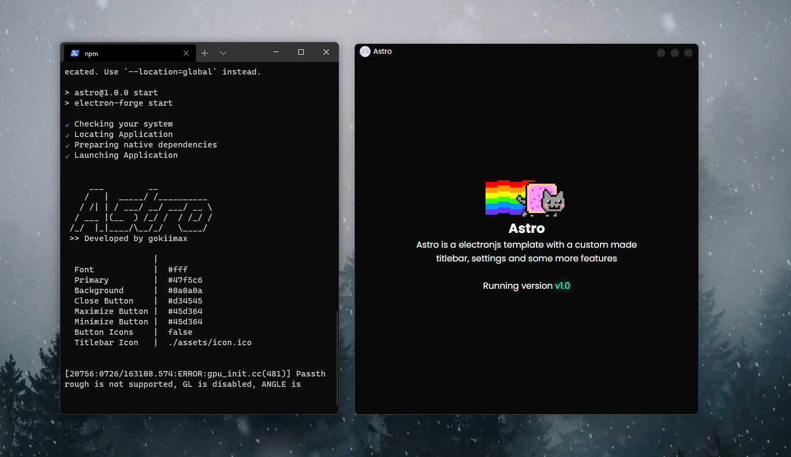

<<<<<<< HEAD

Astro is a electronjs template with a custom made titlebar, settings and some more features coming in the future
=======
# Astro
Astro is a minimialist electronjs template with a custom made titlebar, settings and some more features coming in the future
>>>>>>> 324c7d3fc1181d91cdc5526b7d13251399e62f78

## Install
Cloe the repository and install dependencies:
```bash
git clone https://github.com/gokiimax/Astro.git
cd Astro
npm install
```

## Starting Development
Start the demo app
```bash
npm start
```
or start editing the index.js file in `./src/`

## Packaging
To package apps for your platform:
```bash
npm run package
```

## Docs
Documentation are coming soon!

## Community
Join my [Discord](https://discord.gg/yVWygKS3Xn)

## ☕️ Support & Socials
My Website is open source and free to use. If you found any of my repos useful and would like to support my projects, feel free to donate to my bitcoin address.

### 🔗 bc1qvchfpnjgwwgm7hel5sd70t7v4c4n89c3z7dyd7

[](https://tiktok.com/@maxii.x6)
[](https://twitter.com/gokimax_x)
[](https://instagram.com/maxii.x6)
